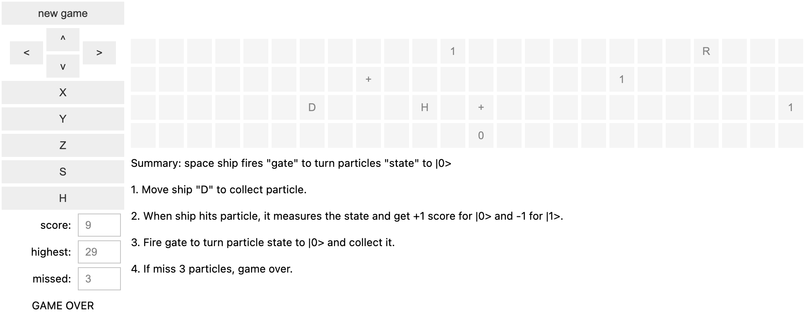

# Space ship

## Play instruction
Summary: space ship fires "gate" to turn particles "state" to |0>
1. Move ship "D" to collect particle.
2. When ship hits particle, it measures the state and get +1 score for |0> and -1 for |1>.
3. Fire gate to turn particle state to |0> and collect it.  For example,
    1. fire X gate to turn |1> into |0>
    2. fire H gate to turn |+> into |0>
    3. fire S, H and then X gates to turn |R> into |0>
4. If miss 3 particles, game over.

## Screenshot

## Game parameters

The following global variables may be modified to increase the game difficulty.

1. SCREEN_Y: add more lanes
2. PARTICLE_SPEED_X: faster particles

## Implementation

1. Use ipywidgets so that it can be played inside browser or vscode with jupyter.
